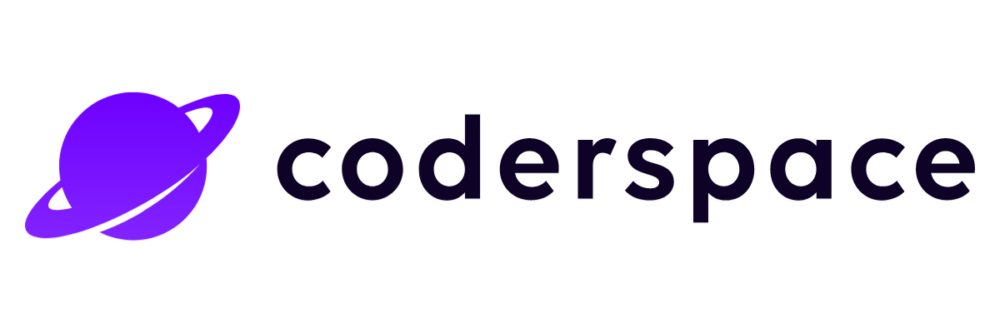
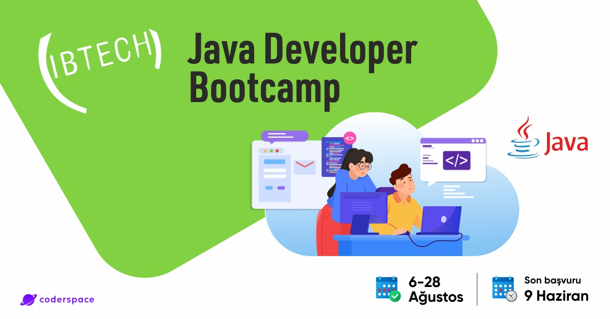

 
  
    

<h1 align="center"> IBTech Java Developer Bootcamp </h1>
<h3 align="center"> Bootcamp Homeworks & Projects Repo </h3>  

 

 
  

<!-- TABLE OF CONTENTS -->
<h2 id="table-of-contents"> :book: İçerik</h2>

  
İçerik

  <ol>
    <li><a href="#hakkinda"> ➤ Repo Hakkında</a></li>
    <li><a href="#teknolojiler"> ➤ Kullanılan Teknolojiler</a></li>
    <li><a href="#kurulum"> ➤ Kurulum</a></li>
     <li>
      <a href="#homeworks"> ➤ Ödevler</a>
      <ul>
        <li><a href="#hw">Tümünü Gör</a></li>
        <li><a href="#hw-00-01">HW-00-01</a></li>
        <li><a href="#hw-00-02">HW-00-02</a></li>
        <li><a href="#hw-00-03">HW-00-03</a></li>
        <li><a href="#hw-00-04">HW-00-04</a></li>
        <li><a href="#hw-01-01">HW-01-01</a></li>
        <li><a href="#hw-01-02">HW-01-02</a></li>
        <li><a href="#hw-03-01">HW-03-01</a></li>
        <li><a href="#hw-03-02">HW-03-02</a></li>
        <li><a href="#hw-03-03">HW-03-03</a></li>
        <li><a href="#hw-04-01">HW-04-01</a></li>
        <li><a href="#hw-04-02">HW-04-02</a></li>
        <li><a href="#hw-05-01">HW-05-01</a></li>
        <li><a href="#hw-05-02">HW-05-01</a></li>
        <li><a href="#hw-05-02-2">HW-05-02-2</a></li>
        <li><a href="#hw-05-03">HW-05-03</a></li>
        <li><a href="#hw-06-01">HW-06-01</a></li>
        <li><a href="#hw-06-02">HW-06-02</a></li>
        <li><a href="#hw-06-03">HW-06-03</a></li>
        <li><a href="#hw-06-04">HW-06-04</a></li>
      </ul>
    </li>
     <li>
      <a href="#pr"> ➤ Bootcampte Yapılan Projeler</a>
      <ul>
        <li><a href="#projects">Tümünü Gör</a></li>
        <li><a href="#project00">Project00</a></li>
        <li><a href="#project01">Project01</a></li>
        <li><a href="#project02">Project02</a></li>
        <li><a href="#project03">Project03</a></li>
        <li><a href="#project04">Project04</a></li>
        <li><a href="#project05">Project05</a></li>
      </ul>
    </li>
    <li><a href="#gelistirme"> ➤ Bootcamp Hakkında</a></li>
    <li><a href="#iletisim"> ➤ İletişim ve Bilgiler</a></li>
  </ol>

<!-- ABOUT THE PROJECT -->
<h2 id="hakkinda"> :pencil: Repo Hakkında</h2>

 
<b>Kullanılan IDE ve Ortam:</b>
IDE olarak Intelij IDEA tercih edilmiştir. Yapılan tüm ödevler 'Homeworks' klasörü altında
toplanılarak Java Modülü olarak ayrılmıştır. Verilen ilk ödevler de klasik java modülü oluşturularak yapılmıştır.
Ancak JSP ile birlikte Enterprise modülüne geçiş yapılmıştır.  
<b>Bootcampte Yazılan Projeler:</b> 
<b>Projects:</b> 
●Derste yazılan projeler aynen IDE ortamına aktarılmış ve doğrudan yazılmıştır.  
<b>İnceleme:</b> 
●İlgili klasör veya proje adına tıklayarak kaynağa ulaşabilirsiniz.

<!-- PREREQUISITES -->
<h2 id="teknolojiler"> :fork_and_knife: Kullanılan Teknolojiler</h2>

  

<!--This project is written in Python programming language.  -->
Projede kullanılan diğer teknolojiler:

* Java 8
* Maven
* JSP
* JAXP
* JAVA IO
* SERVLET
* TOMCAT 9.5
* PostgreSQL
* JDBC

<h2 id="kurulum"> :hammer: Git ile Kurulum</h2>

 
1. Öncelikle projeyi GitHub deposundan klonlayın.

    git clone https://github.com/byofficial/ibtech-java-developer-bootcamp.git

2.Maven ile bağımlılıkların yümlenmesini bekleyin. 

<h2 id="homeworks"> :hammer: Ödevler</h2>

<b><a href="https://github.com/byofficial/ibtech-java-developer-bootcamp/tree/main/Homeworks">✤ Tüm Ödevler1</a></b> 
<b><a href="https://github.com/byofficial/ibtech-java-developer-bootcamp/tree/main/Homeworks/HW-00-01">✤ HW-00-01</a></b> 
<b><a href="https://github.com/byofficial/ibtech-java-developer-bootcamp/tree/main/Homeworks/HW-00-02">✤ HW-00-02</a></b> 
<b><a href="https://github.com/byofficial/ibtech-java-developer-bootcamp/tree/main/Homeworks/HW-00-03">✤ HW-00-03</a></b> 
<b><a href="https://github.com/byofficial/ibtech-java-developer-bootcamp/tree/main/Homeworks/HW-00-04">✤ HW-00-04</a></b> 
<b><a href="https://github.com/byofficial/ibtech-java-developer-bootcamp/tree/main/Homeworks/HW-01-01">✤ HW-01-01</a></b> 
<b><a href="https://github.com/byofficial/ibtech-java-developer-bootcamp/tree/main/Homeworks/HW-01-02">✤ HW-01-02</a></b> 
<b><a href="https://github.com/byofficial/ibtech-java-developer-bootcamp/tree/main/Homeworks/HW-03-01">✤ HW-03-01</a></b> 
<b><a href="https://github.com/byofficial/ibtech-java-developer-bootcamp/tree/main/Homeworks/HW-03-02">✤ HW-03-02</a></b> 
<b><a href="https://github.com/byofficial/ibtech-java-developer-bootcamp/tree/main/Homeworks/HW-03-03">✤ HW-03-03</a></b> 
<b><a href="https://github.com/byofficial/ibtech-java-developer-bootcamp/tree/main/Homeworks/HW-04-01">✤ HW-04-01</a></b> 
<b><a href="https://github.com/byofficial/ibtech-java-developer-bootcamp/tree/main/Homeworks/HW-04-02">✤ HW-04-02</a></b> 
<b><a href="https://github.com/byofficial/ibtech-java-developer-bootcamp/tree/main/Homeworks/HW-05-01">✤ HW-05-01</a></b> 
<b><a href="https://github.com/byofficial/ibtech-java-developer-bootcamp/tree/main/Homeworks/HW-05-02">✤ HW-05-02</a></b> 
<b><a href="https://github.com/byofficial/ibtech-java-developer-bootcamp/tree/main/Homeworks/HW-05-02-2">✤ HW-05-02-2</a></b> 
<b><a href="https://github.com/byofficial/ibtech-java-developer-bootcamp/tree/main/Homeworks/HW-05-03">✤ HW-05-03</a></b> 
<b><a href="https://github.com/byofficial/ibtech-java-developer-bootcamp/tree/main/Homeworks/HW-06-01">✤ HW-06-01</a></b> 
<b><a href="https://github.com/byofficial/ibtech-java-developer-bootcamp/tree/main/Homeworks/HW-06-02">✤ HW-06-02</a></b> 
<b><a href="https://github.com/byofficial/ibtech-java-developer-bootcamp/tree/main/Homeworks/HW-06-03">✤ HW-06-03</a></b> 
<b><a href="https://github.com/byofficial/ibtech-java-developer-bootcamp/tree/main/Homeworks/HW-06-04">✤ HW-06-04</a></b> 

<h2 id="pr"> :hammer: Bootcampte Yapılan Projeler</h2>

<b><a href="https://github.com/byofficial/ibtech-java-developer-bootcamp/tree/main/Projects">✤ Tümünü Gör</a></b> 
<b><a href="https://github.com/byofficial/ibtech-java-developer-bootcamp/tree/main/Projects/Project00">✤ Project00</a></b> 
<b><a href="https://github.com/byofficial/ibtech-java-developer-bootcamp/tree/main/Projects/Project01">✤ Project01</a></b> 
<b><a href="https://github.com/byofficial/ibtech-java-developer-bootcamp/tree/main/Projects/Project02">✤ Project02</a></b> 
<b><a href="https://github.com/byofficial/ibtech-java-developer-bootcamp/tree/main/Projects/Project03">✤ Project03</a></b> 
<b><a href="https://github.com/byofficial/ibtech-java-developer-bootcamp/tree/main/Projects/Project04">✤ Project04</a></b> 
<b><a href="https://github.com/byofficial/ibtech-java-developer-bootcamp/tree/main/Projects/Project05">✤ Project05</a></b> 

<!-- CONTRIBUTORS -->
<h2 id="gelistirme"> :scroll: Bootcamp Hakkında</h2>

  :mortar_board: <i> IBTech Java Developer Bootcamp için hazırlanmıştır. <a href="https://coderspace.io/etkinlikler/ibtech-java-developer-bootcamp/">Coderspace İlan Link</a></i>    

 

<h2 id="iletisim"> :scroll: İletişim ve Bilgiler</h2>

✤ <a href="mailto:burak@yaztem.com">Mail</a>  
✤ <a href="https://linkedin.com/in/byofficial">LinkedIn</a>  
✤ <a href="https://github.com/byofficial">GitHub</a>  
✤ <a href="https://www.youtube.com/channel/UCS4zK06kG5KY4Wtl2C9m5bg">YouTube</a>  
✤ <a href="https://www.udemy.com/user/burak-yildiz-120/">Udemy</a>  
✤ <a href="https://bit.ly/py390">Python Projeler ve Popüler Kütüphaneler Kitabı</a>  